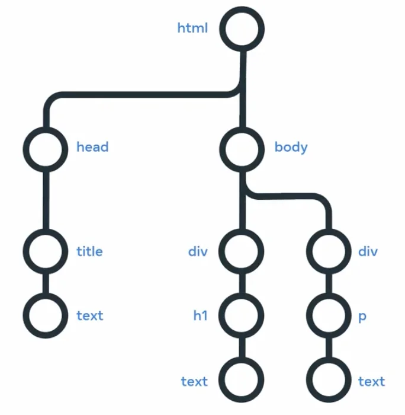

# Course 1 - Introduction to Front-End Development

1.software engineer is not coding the whole day, but solving problems.
2. the goal is to grow.

## Course syllabus

This course is the first of a series that aims to help you learn more about web development and prepares you for using Bootstrap on a biographical page you will create.  By the end of this course, you’ll be able to:

- Describe the front-end developer role
- Explain the core and underlying technologies that power the internet
- Use HTML to create a simple webpage
- Use CSS to control the appearance of a simple webpage
- Explain what React is
- Describe the applications and characteristics of the most popular UI frameworks

## Module 1

### Networks
- Client <-> server
- Web server is stored in a data center.
- there are all around the word. there are different
- javascript is the powerhouse of the web
- page rendering
- url include the protocol (http) hte domain name and the path to the page.
- request <-> response on the internet
- individuals and companies can pay for web hosting
  - there is shared hosting that you share a server with other websites, which you share the bandwidth, performance and memory which may slow your site.
  - There is VPS (Virtual Server )  with dedicated CPU, memory, and bandwidth resources. It will be running on a hardware server with other VPS instances but as the resources are fixed per VPS instance, your website is unlikely to be impacted by the performance of other VPS instances.
  - And then is dedicated hosting. This will be a hardware server that is dedicated to you only.And is more expensive.
  - The last type of web hosting is something you may have heard of. Cloud hosting and the Cloud has grown in popularity over the last decade and is often mentioned in various news and services you use. With Cloud hosting, your website is run in something called a Cloud environment, which spans across multiple physical and virtual servers. The main advantage of Cloud hosting is that you can use as many resources as you need without hardware limitations. However, you pay based on resource use.

### Introduction to Internet Protocols

#### IP
IPv4 is separated in four groups: 192.168.1.0
IPv6 is 8 groups by 4 digits: xxxx:xxxx:xxxx:xxxx:xxxx:xxxx:xxxx:xxxx

-Ip packages are like mail they need the senders and the recipient address, also include other infos.

#### Transfer Protocols

Firstly, it is a protocol used by web clients and web servers. It works to transfer web resources such as HTML files, and is the foundation of any data exchanges on the web.

- When delivery a data is possible to be damage/corropted or out of order or can lost.and for this we hace transmition protocols (like **TCP** or **UDP**(user datagram protocol)) to solve this issues.
  - TCP is server to device to solve all three of the previously mentioned issues but at the cost of a small delay when sending the data.
  - UDP solves the corrupt packet issue but packets can still arrive out of order or not arrive at all.

#### HTTP and HTTPS

##### 1. Request Line

- Every HTTP request begins with the request line. This consists of the HTTP method, the requested resource and the HTTP protocol version.
- `GET /home.html HTTP/1.1`: In this example, GET is the HTTP method, /home.html is the resource requested and HTTP 1.1 is the protocol used.
- HTTP Methods: HTTP methods indicate the action that the client wishes to perform on the web server resource.

##### 2. HTTP Methods

The HTTP method describes the type of action that the client must performed. The primary or the most commonly used HTTP methods are, GET, POST, PUT, and DELETE.

1. `GET` used to retrieve information from the given server.
1. `POST` request is used to send data to the server.
1. `PUT` method updates whatever currently exists on the web server with something else.
1. `DELETE` method removes the resource.

versions 1.1 and 2.0 are the most common.

##### 3. HTTP Request Headers

After the request line, the HTTP headers are followed by a line break.

There are various possibilities when including an HTTP header in the HTTP request. A header is a case-insensitive name followed by a: and then followed by a value.

##### 4. HTTP Request Body

HTTP requests can optionally include a request body. A request body is often included when using the HTTP POST and PUT methods to transmit data.

```http
POST /users HTTP/1.1
Host: example.com

{
 "key1":"value1",
 "key2":"value2",
 "array1":["value3","value4"]
}
```

##### 5. HTTP Responses

##### 6. Status code

`HTTP/1.1 200 OK` the 200 is could be from 100~599 are grouped by purpose, for ex. 404 is an error not found

###### 6.1. Informational 100~199

– provisional responses sent by the server. These responses are interim before the actual response. The most common information response is 100 continue, which indicates that the web client should continue to request or ignore the response if the request is already finished.

###### 6.2. Successful 200~299

Successful responses indicate that the request was successfully processed by the web server, with the most common success response being 200 OK. The meaning of OK, depends on the HTTP method. If the method is GET, it means that the resource is found and is included in the body of the HTTP response. If it's POST, it means that the resource was successfully transmitted to the web server and if it's PUT, the resource was successfully transmitted to the web server. Finally, if the method is DELETE, it means the resource was deleted.

###### 6.3. Redirectional 300~399

Redirection responses indicate to the web client that the requested resource has been moved to a different path. The most common response codes used are 301 moved permanently and 302 found. The difference between the redirection messages 301 and 302 is that 302 indicates a temporary redirection.The resource has been temporarily moved. When web browsers receive these responses, they will automatically submit the request for the resource at the new path.

###### 6.4. Client Error 400~499

Client error responses indicate that the requests contained bad syntax or content and cannot be processed by the web server. The most common codes used are 400 is used when the web browser or client submitted bad data to the web server, 401 is used to indicate that the user must log into an account before the request can be processed, 403 is used to indicate the request was valid, but that the web server is refusing to process it. This is often used to indicate that a user does not have sufficient permissions to execute an action in a web application, 404 is used to indicate that the request resource was not found on the web server.

###### 6.5. Server Error 500~599

Server error responses indicate that a failure occurred on the web server while trying to process the request. The most common code used is 500 internal server error, which is a generic error status indicating that the server failed to process the request.

##### 7. HTTP Response Headers

Following the status line, there are optional HTTP response headers followed by a line break.

```http
Date: Fri, 11 Feb 2022 15:00:00 GMT+2
Server: Apache/2.2.14 (Linux)
Content-Length: 84
Content-Type: text/html
```

1. The Date header specifies the date and time the HTTP response was generated.
1. The Server header describes the web server software used to generate the response.
1. The Content-Length header describes the length of the response.
1. The Content-Type header describes the media type of the resource returned (e.g. HTML document, image, video).

##### 8. HTTP Response Body

This is the main content of the HTTP response. This can contain images, video, HTML documents and other media types.

```http
HTTP/1.1 200 OK
Date: Fri, 11 Feb 2022 15:00:00 GMT+2
Server: Apache/2.2.14 (Linux)
Content-Length: 84
Content-Type: text/html

<html>
  <head><title>Test</title></head>
  <body>Test HTML page.</body>
</html>
```

##### 9. HTTPS

It is used for secure communication between two computers so that nobody else can see the information being sent and received. It does this by using something called encryption. We won't cover encryption right now. Like in HTTP, the requests and responses still behave in the same way and have the same content. The big difference is that before the content is sent, it is turned into a secret code.

Only the other computer can turn the secret code back into its original content. If someone else was to look at the code, it wouldn't be understandable.

#### Dynamic Host Configuration Protocol (DHCP)

You've learned that computers need IP addresses to communicate with each other. When your computer connects to a network, the Dynamic Host Configuration Protocol or DHCP as it is commonly known, is used to assign your computer an IP address.
Your computer communicates over User Datagram Protocol (UDP) using the protocol with a type of server called a DHCP server. The server keeps track of computers on the network and their IP addresses. It will assign your computer an IP address and respond over the protocol to let it know which IP address to use. Once your computer has an IP address, it can communicate with other computers on the network.

Domain Name System Protocol (DNS)
Your computer needs a way to know with which IP address to communicate when you visit a website in your web browser, for example, meta.com. The Domain Name System Protocol, commonly known as DNS, provides this function. Your computer then checks with the DNS server associated with the domain name and then returns the correct IP address.

#### Domain Name System Protocol (DNS)

Your computer needs a way to know with which IP address to communicate when you visit a website in your web browser, for example, meta.com. The Domain Name System Protocol, commonly known as DNS, provides this function. Your computer then checks with the DNS server associated with the domain name and then returns the correct IP address.

#### Internet Message Access Protocol (IMAP)

Do you check your emails on your mobile or tablet device? Or maybe you use an email application on your computer?
Your device needs a way to download emails and manage your mailbox on the server storing your emails. This is the purpose of the Internet Message Access Protocol or IMAP.

#### Simple Mail Transfer Protocol (SMTP)

Now that your emails are on your device, you need a way to send emails. The Simple Mail Transfer Protocol, or SMTP, is used. It allows email clients to submit emails for sending via an SMTP server. You can also use it to receive emails from an email client, but IMAP is more commonly used.

#### Post Office Protocol (POP)

The Post Office Protocol (POP) is an older protocol used to download emails to an email client. The main difference in using POP instead of IMAP is that POP will delete the emails on the server once they have been downloaded to your local device. Although it is no longer commonly used in email clients, developers often use it to implement email automation as it is a more straightforward protocol than IMAP.

#### File Transfer Protocol (FTP)

When running your websites and web applications on the Internet, you'll need a way to transfer the files from your local computer to the server they'll run on. The standard protocol used for this is the File Transfer Protocol or FTP. FTP allows you to list, send, receive and delete files on a server. Your server must run an FTP Server and you will need an FTP Client on your local machine. You'll learn more about these in a later course.

#### Secure Shell Protocol (SSH)

When you start working with servers, you'll also need a way to log in and interact with the computer remotely. The most common method of doing this is using the Secure Shell Protocol, commonly referred to as SSH. Using an SSH client allows you to connect to an SSH server running on a server to perform commands on the remote computer.
All data sent over SSH is encrypted. This means that third parties cannot understand the data transmitted. Only the sending and receiving computers can understand the data.

#### SSH File Transfer Protocol (SFTP)

The data is transmitted insecurely when using the File Transfer Protocol. This means that third parties may understand the data that you are sending. This is not right if you transmit company files such as software and databases. To solve this, the SSH File Transfer Protocol, alternatively called the Secure File Transfer Protocol, can be used to transfer files over the SSH protocol. This ensures that the data is transmitted securely. Most FTP clients also support the SFTP protocol.

### Webpages, websites and pages

The terms website and web application are often used interchangeably. The key difference between a website, and web application is the level of interactivity, and dynamic content. The easy way to remember this is that a website is more informative and a web application is more interactive.
Web application can be used to create dynamic content, such as a blog or a social media platform. And
web pages at a particular domain make up a website, and that the key difference between websites, and web applications is the level of interactivity, and dynamic content.

### Additional Resources

Here is a list of resources that may be helpful as you continue your learning journey.

1. HTTP Overview [(Mozilla)](https://developer.mozilla.org/en-US/docs/Web/HTTP/Overview)
1. [Introduction to Networking](https://www.amazon.com/Introduction-Networking-How-Internet-Works/dp/1511654945/) by Dr.Charles R Severance
1. Chrome Developer Tools Overview [(Google)](https://developer.chrome.com/docs/devtools/overview/)
1. (https://firefox-source-docs.mozilla.org/devtools-user/index.html)
1. Getting Started with Visual Studio Code  [(Microsoft)](https://code.visualstudio.com/docs)

## Module 2

### What is Hyper Text Markup Language?

#### HTML syntax

##### Headers

```html
<h1>Heading 1</h1>
<h2>Heading 2</h2>
<h3>Heading 3</h3>
<h4>Heading 4</h4>
<h5>Heading 5</h5>
<h6>Heading 6</h6>
<p>
   This paragraph<br>
   contains a lot of lines
   but they are ignored. <strong>don't feed him chocolate</strong>
</p>
```

##### Strong tags

Can be used to indicate that a range of text has importance.
`No matter how much the dog barks: <strong>don't feed him chocolate</strong>.`

##### Bold tags

should be used to draw attention but not to indicate that something is more important.
`The three core technologies of the Internet are <b>HTML</b>, <b>CSS</b> and <b>Javascript</b>.`

##### Emphasis tags

can be used to add emphasis to text.
`Wake up <em>now</em>!`

##### Italics tags

can be used to offset a range of text. Italics represent off-set text and should be used for technical terms, titles, a thought or a phrase from another language. Screen readers will not announce any difference if an italics tag is used.
`My favourite book is <i>Dracula</i>.`

##### Lists

Lists can be unordered using the `<ul>` tag. List items are specified using the `<li>` tag,

```html
<ul>
   <li>Tea</li>
   <li>Sugar</li>
   <li>Milk</li>
</ul>
```

Lists can also be ordered (1. 2. 3.) using the `<ol>` tag. Again, list items are specified using the `<li>` tag.
```html
<ol>
   <li>Rocky</li>
   <li>Rocky II</li>
   <li>Rocky III</li>
</ol>
```

#### Divs Tags

A `<div>` tag defines a content division in a HTML document. It acts as a generic container and has no effect on the content unless it is styled by CSS.

```html
<div>
   <p>This is a paragraph inside a div</p>
</div>

<!-- can also be nested-->

<div>
   <div>
      <p>This is a paragraph inside a div that’s inside another div</p>
   </div>
</div>
```

##### Text Field

- There is POST and GET methods.

```html
<form action="/registration" method="POST">
```

###### Password Username
You can create labels for input types with the label tag, you use the text input type for a text input like a user name. For a password, you use the password input type.

```html
<form>
    <label for="username">Username</label><br>
    <input type="text" id="username" name="username">
    <label for="password">Password</label><br>
    <input type="password" id="password" name="password" />
    <input type="submit" value="Submit" />
</form>
```

###### CheckBox

Multiple can be selected

```html
<label for="vehicle1">I have a bike</label>
<input type="checkbox" name="vehicle1" value="Bike">
```

###### Radio Button

Only one can be selected

```html
<input type="radio" id="male" name="gender" value="male">
<label for="male">Male</label><br>
<input type="radio" id="female" name="gender" value="female">
<label for="female">Female</label><br>
<input type="radio" id="other" name="gender" value="other">
<label for="other">Other</label>
```

### DOM (Document Object Model)

Imagine your favorite social media site. If it was just an HTML document, users would be able to scroll the page, look at pictures and read text but they wouldn't be able to log in like posts or get notifications for new messages. In order to allow users to do these things, they need to be able to interact with objects on the page such as the reaction icons or the comment button.
an HTML document must be represented in a certain way, so that `JavaScript` code can query and update it, to do this we use the document object model.



### Web accessibility

It does not only visual dissaibiliet, but physical, audio, cognitive/neurological disabilities. To ensure that your website is accessible to all users, you should follow the Web Content Accessibility Guidelines (WCAG) 2.1.

Screen reader software, speech recognition software, subtitles and scripts, and other assistive technologies.

- To improve it:
  - Use semantic HTML elements
  - Provide alternative text for images
  - Ensure proper color contrast
  - Use ARIA(Accessible Rich Internet Applications) attributes for complex interactions

- ARIA in HTML (W3C via [Github](https://w3c.github.io/html-aria/))
- ARIA [Authoring Practices](https://www.w3.org/TR/wai-aria-practices-1.2/) (W3C)

### Styling

```css
h1 {
    color: aquamarine;
}
```

1. The selector is the *h1*.
1. Everything between the curly brackets is called the declaration block.
1. *Color* is the Property.
1. *Blue* is the Value.

#### 1. Element Selectors

Based on element type.
`p { color: blue; }`

#### 2. ID Selectors

The ID selector uses the id attribute of an HTML element. Since the id is unique within a webpage, it allows the developer to select a specific element for styling.

```css
#latest {
  background-color: purple;
}
```

#### 3. Class Selectors

he CSS rule has been applied to all elements with the specified class name.

```css
.navigation {
  margin: 2px;
}
```

#### 4. Element with Class Selector

A more specific method for selecting HTML elements is by first selecting the HTML element, then selecting the CSS class or ID.

```css
p.introduction {
  margin: 2px;
}
```

#### 5. Descendant Selectors

Descendant selectors are useful if you need to select HTML elements that are contained within another selector.

```css
#blog h1 {
  color: blue;
}
```

#### 6. Child Selector

Child selectors are more specific than descendant selectors. They only select elements that are *immediate descendants* (children) of a selector (the parent).

```css
#blog > h1 {
  color: blue;
}
```

#### 7. Pseudo-Class

A special keyword called a pseudo-class allows developers to select elements based on their state. Don't worry too much about what that means right now. For now, let's look at how the hover pseudo-class allows you to style an element when the mouse cursor hovers over the element.

The simplest example of this is changing the color of a hyperlink when it is hovered over. To do this, you add the `:hover` pseudo-class to the end of the selector. In the following example, adding `:hover`  to the a element will change the color of the hyperlink to orange when it is hovered over

```css
a:hover {
  color: orange;
}
```

### Color in CSS

By RGB value, RGBA value, HSL value, hex value and predefined color names.

#### 1. RGB value
Each value is defined as a number between 0 and 255, representing the intensity of that color.

`p { color: rgb(255, 0, 0); }`

RGBA is an extension of RGB that add an alpha (A) channel. The alpha channel represents the opacity, or transparency, of the color.

`p { color: rgba(255, 0, 0, 0.8); }`

#### 2. HSL value

HSL is a newer color model defined as Hue (H), Saturation (S) and Lightness (L). The aim of the model is to simplify mental visualization of the color that the value represents.

`p { color: hsl(125, 78.10%, 37.60%);}`

#### 3. Hex value

Colors can be specified using a hexadecimal value. If you're unfamiliar with hexadecimal, think of it as a different number set.
For example, the color red which is RGB 255,0,0 would be written as hexadecimal #FF0000.

#### 4. Predefined color names

Modern web browsers support 140 predefined color names. These color names are for convenience purposes and can be mapped to equivalent hex/RGB/HSL values.

`silver`

### Text in CSS

#### 1. Text Color

`p {  color: red;}`

#### 2. Text Font and Size

To set the font used by text in CSS you use the font-family property.

`p { font-family: "Courier New", monospace;}`

#### 3. Text Transformation

Text transformation is useful if you want to ensure the correct capitalization of the text content.

`p {text-transform: uppercase;}`

The most commonly used values for the text-transform property are:  uppercase,  lowercase,  capitalize  and none. The default value used is none, which means the text displays as it was written in the HTML document.

#### Text Decoration

useful to apply additional decoration to text such as underlining and line-through (strikethrough).

`p {text-decoration: underline;}`

It is possible to set the color, thickness and styling of the decoration too.

`p {text-decoration: underline red solid 5px;}`

These properties can be individually set using the text-decoration-line, text-decoration-color, text-decoration-style and text-decoration-thickness properties.

```css
p {
  text-decoration-line: underline;
  text-decoration-color: red;
  text-decoration-style: solid;
  text-decoration-thickness: 5px;
}
```

### Box model

How to use the box model in CSS to create an appealing layout and allow users eyes to easily flow between content.

When an HTML document and CSS style sheet are downloaded, the web browser needs to know how to display the elements on the screen.
To do this, it allocates a rectangle or **box** to each element. CSS rules are applied to the **boxes of the elements** *(This is known as the box model)*. Every box consists of four parts.
1. The content
1. the padding
1. the border
1. the margin.
The content is the actual content of the element, like the text or the image. Its size is known as the content width and content height. Browsers are clever and by default, they will calculate the width and height based on the content itself.

#### 1. The Padding

The padding extends the content size. Its size is known as the padding box width and the padding box height.
The thickness of the padding is determined by the padding top, padding bottom, padding left and padding right. **The padding box** width can be calculated as content width plus padding left side plus padding right side.

#### 2. The Border

The border extends the padding size. Its size is known as the border box width and the border box height.
**The border box** width can be calculated as padding width plus border left side plus border right side.

#### 3. The Margin

The margin extends the border area to separate the element from its neighboring elements. Its size is known as the margin box width, a margin box height.
The thickness of the margin is determined by the margin top, margin bottom, margin left and margin right. **The margin box** width can be calculated as border width plus margin left side plus margin right side.

#### 4. Conclusion

To easily remember this four, think of the content as yourself. The padding is like the thickness of your clothes. The border is like the silhouette or outline and the margin is the personal space between you and another person.

### Document Flow

#### block vs. inline

- Block elements are displayed as blocks, meaning they start on a new line and take up the full width of their container.
- Inline elements are displayed inline, meaning they do not start on a new line and only take up as much width as necessary, so can be placed next to each other side by side.

#### Alignment basics

- Alignment refers to the positioning of content within its container.
- Horizontal alignment can be achieved using the text-align property.
- Vertical alignment can be achieved using the vertical-align property.

The `justify` alignment spreads the text out so that every line of the text has the same width.

To **align the element to the center**, set its `margin` property to `auto`. The auto will tell the browser to calculate the margin automatically based on the space available. The child element will be centered within the parent element.

To be more precise, in CSS you can set only the left and right margins to auto. This allows you to set the top and bottom margins to specific values if needed.

```css
.child {
  display: block;
  width: 50%;
  margin-left: auto;
  margin-right: auto;
}
```

### Additional resources

[CSS Reference (Mozilla)](https://developer.mozilla.org/en-US/docs/Web/CSS/Reference)
HTML and CSS: Design and build websites by [Jon Duckett](https://www.amazon.com/HTML-CSS-Design-Build-Websites/dp/1118008189/)
[CSS Definitive Guide](https://www.amazon.com/CSS-Definitive-Guide-Visual-Presentation/dp/1449393195/) by Eric Meyer

### What we learned in this module

1. HTML purpose
1. HTML tags
1. HTML attributes
1. CSS rules
1. Box Model
1. Document structure
1. Document flow

## 3. Module 3: Working with libraries

### 3.1 Intro

1. How to include CSS and JavaScript libraries in your HTML file
1. explain what dependencies are
1. purpose of a package manager and JavaScript handlers

Bootstrap is a popular CSS framework that provides pre-designed components and styles for building responsive websites.

You should include a link tap in the html head section.

Complications of using libraries can arise from libraries can depend on other libriaries, a *depency tree*. If a project have a lot of dependencies it will take too long to download, setup and so on. And how do you make sure you use the same version of the dependencies as your coworkers? Thats when a **package managers**(we also refere depencies as packages) we can use package manager can help you manage your dependencies. A package manager is a tool that automatically downloads and installs dependencies.

The most popular package manager for JavaScript is [npm](https://www.npmjs.com/).

Now that all your dependencies are downloaded, you need to include them in your HTML file. But adding all of them into an HTML file would take forever. This is where you will use a bundling tool. The purpose of a bundler is to automatically combine them into a single file. If you're bundle is significantly large, many bundles can split your dependencies into multiple bundles. There are many bundle is available such as Gulp and Webpack.

### 3.2 Responsive Design

Given all the possibilities and complicating factors, it would be challenging to develop websites that appear correctly on all kinds of devices if it wasn't for responsive design. Responsive design is a set of three practices that allows a website to automatically change its visuals. It is the combination of three techniques, flexible grids, fluid images and media queries.

#### 3.2.1 Flexible Grids

flexible grids are made up of columns, gutters and margins. The space between the columns is called the gutter and the spaces between the content and the left and right edges of the screen are called margins. Instead of defining website Element sizes based on pixels, flexible grids are defined in percentage values, allowing them to adjust depending on screen size.

#### 3.2.2 Fluid Images

Fluid images are images that scale with the size of the screen. They are defined in percentage values, allowing them to adjust depending on screen size.

- like using `max-width`

#### 3.2.3 Media Queries

Media queries are used to apply different styles to a website depending on the size of the screen. They are defined in CSS and are used to apply different styles to a website depending on the size of the screen. Media queries are defined in CSS and are used to apply different styles to a website depending on the size of the screen.

- `@media (min-width: 768px) {}`

#### 3.2.4 Breakpoints

Breakpoints are used to apply different styles to a website depending on the size of the screen. They are defined in CSS and are used to apply different styles to a website depending on the size of the screen. Breakpoints are defined in CSS and are used to apply different styles to a website depending on the size of the screen.
Can be used on fixed, fluid or hybrid grid layouts.

##### 3.2.4.1 Fixed Grid Layouts

Fixed grid layouts are defined in fixed pixel values, allowing them to adjust depending on screen size.
> for example:
> `auto width blank space | fixed width column 1 | fixed width column 2 | fixed width column 3 | auto width blank space`

##### 3.2.4.2 Fluid Grid Layouts

Fluid grid layouts are defined in percentage values, allowing them to adjust depending on screen size.
> for example:
>`auto width blank space | fixed width column 1 | fixed width column 2 | fixed width column 3 | auto width blank space`

##### 3.2.4.3 Hybrid Grid Layouts

Hybrid grid layouts are a combination of fixed and fluid grid layouts. They are defined in percentage values, allowing them to adjust depending on screen size.

### 4. Bootstrap

1. Bootstrap is often described as a way to *"build fast, responsive sites"* and it is a "feature-packed, powerful, and extensible frontend toolkit".
1. Some people refer to it as a **"front-end" framework**, and some are trying to be more specific by referring to it as a "CSS framework" or a “CSS library”.
1. Modern web development is all about **components**. Small pieces of reusable code that allow you to build websites quickly. Bootstrap comes with multiple components for very fast construction of multiple components, or parts of components.
1. Bootstrap is very popular amongst developers as it saves development time and provides a way for developers to build visually appealing prototypes and websites.

#### 4.1. Bootstrap Grid

It use a 12 column grid system. Each column has a width of 100% / 12 = 8.333333333333334%. The grid system is responsive and adapts to different screen sizes.

```cpp
| 1 | 1 | 1 | 1 | 1 | 1 | 1 | 1 | 1 | 1 | 1 | 1 |
|   2   |   2   |   2   |   2   |   2   |   2   |
|     3     |     3     |     3     |     3     |
|     4          |      4      |        4       |
|            6          |           6           |
|                       12                      |
```

Here is will set this div to be a column with a width of 12 columns on small screens and 6 columns on large screens.
`<div class="col-12 col-lg-6">`

#### 4.2 Bootstrap Components

Bootstrap comes with multiple components for very fast construction of multiple components, or parts of components.

#### 4.3 Bootstrap Documentation

[website](https://getbootstrap.com/docs/5.0/getting-started/introduction/)

##### 4.3.1 Switches

Bootstrap includes CSS rules to style checkbox input elements as switches.

```html
<div class="form-check form-switch">
  <input class="form-check-input" type="checkbox">
</div>
```

##### 4.3.2  Input Groups

Input groups are useful for providing additional content to the input field. For example, if you wanted to request the user to input a US dollar amount, you can use an input group to show the dollar symbol and cents amount.

```html
<div class="input-group">
  <span class="input-group-text">$</span>
  <input type="text" class="form-control">
  <span class="input-group-text">.00</span>
</div>
```

##### 4.3.3 Floating Labels

Floating labels help provide form information to the user as part of the input itself. These are different from regular form placeholders. The information stays visible if the user is interacting with the element or if the element has content.

```html
<div class="form-floating">
  <input type="email" class="form-control" id="addressInput" placeholder="Address">
  <label for="addressInput">Address</label>
</div>
```

##### 4.4.4 Components

Some of these components require Javascript to work, while others only require CSS classes applied to HTML elements. The Components section of the documentation explains these requirements on each component page and provides many code examples.

#### Additional Resources

[Bootstrap Official Website](https://getbootstrap.com/)

[Bootstrap 5 Foundations](https://www.amazon.com/Bootstrap-Foundations-Mr-Daniel-Foreman/dp/B0948GRS8W/) by Daniel Foreman

[Responsive Web Design with HTML5 and CSS](https://www.amazon.com/Responsive-Web-Design-HTML5-CSS/dp/1839211563/)  by Ben Frain

[Bootstrap Themes](https://themes.getbootstrap.com/)


## Module 3

### 3.1 Static and dynamic content

- **Static Content**: Static content is content that does not change. It is content that is the same for all users. For example, a website's header and footer are static content.
- **Dynamic Content**: Dynamic content is content that changes. It is content that is different for each user. For example, a website's user profile is dynamic content. Usually is slower to generate. It usually uses caching to improve performance, instead of generating content dynamically for every request. Caching means the web server keeps a copy of dynamic content. If the content is requested again, the web server can immediately send this cached version instead of passing the request again to the application server. On the first request for dynamic content, the web server checks if the content exists in the cache. If it does not exist, the content is requested from the application server and stored in the cache.

Web server communicate with an application server (backend) to provide dynamic content. Application server communicate with a database to retrieve data.

### 3.2 Single Page application (SPA)


It means that the application is a single page, and the user does not need to reload the page to navigate between different pages. Instead, the application uses JavaScript to dynamically update the content of the page.

#### 3.2.1 Bundling

Bundling is the process of combining multiple JavaScript files into a single file. This is done to reduce the number of HTTP requests made by the browser, which can improve performance. Bundling can be done using tools like Webpack or Rollup.

#### 3.2.2 Lazy Loading

Lazy loading is the process of loading content only when it is needed. This is done to improve performance. Lazy loading can be done using tools like React Lazy or Vue Lazy.

### 3.3 What is React?

1. React is focused on working with components, which makes it simple to build functional user interfaces on web and mobile.
1. One of the most popular libraries.
1. From 2013.
1. Developers use React to develop single page applications and you can also develop mobile applications with React native. When you develop an app, you can choose to use React to develop the user interface. But building an application requires more than that. You must also consider the navigation and how the app will request data from a web server. Therefore React is used in conjunction with other JavaScript libraries during development.
1. what makes React so useful is that it allows developers to write less code to create functionality. This in turn makes it easier to maintain code in the long term and simplifies testing.
1. **Components**: React components are the building blocks of React applications. They are reusable pieces of code that can be used to create complex user interfaces. Components can be created using JavaScript classes or functions.
1. There are in fact many open source libraries that provide pre made components for React projects. For example, video player, maps, etc.

#### 3.3.1 React isn’t an MVC framework

React is a library for building composable user interfaces. It encourages the creation of reusable UI components which present data that changes over time.

#### 3.3.2 React doesn’t use templates

Traditionally, web application UIs are built using templates or HTML directives. These templates dictate the full set of abstractions that you are allowed to use to build your UI.

#### 3.3.3 Meta created JSX
An optional syntax extension, in case you prefer the readability of HTML to raw JavaScript.

#### 3.3.4 React updates are dead simple

In a traditional JavaScript application, you need to look at what data changed and imperatively make changes to the DOM to keep it up-to-date.

When your component is first initialized, the `render` method is called, generating a lightweight representation of your view. From that representation, a string of markup is produced and injected into the document. When your data changes, the `render` method is called again. In order to perform updates as efficiently as possible, we diff the return value from the previous call to `render` with the new one and generate a minimal set of changes to be applied to the DOM.

The data returned from render is neither a string nor a DOM node — it’s a lightweight description of what the DOM should look like.

We call this process `reconciliation`. Check out
this [jsFiddle](https://jsfiddle.net/uf3sr8L7/) to see an example of reconciliation in action.

Because this re-render is so fast (around 1ms for TodoMVC), the developer doesn’t need to explicitly specify data bindings. We’ve found this approach makes it easier to build apps.

#### 3.3.5 HTML is just the beginning

Because React has its own lightweight representation of the document, we can do some pretty cool things with it:

- Facebook has dynamic charts that render to <canvas> instead of HTML.
- Instagram is a “single page” web app built entirely with React and Backbone.Router. Designers regularly contribute React code with JSX.
- We’ve built internal prototypes that run React apps in a web worker and use React to drive native iOS views via an Objective-C bridge.
- You can run React on the server for SEO, performance, code sharing and overall flexibility.
- Events behave in a consistent, standards-compliant way in all browsers (including IE8) and automatically use event delegation.

Head on over to [reactjs](https://reactjs.org) to check out what we have built.

### 3.4 How React works

#### 3.4.1 React Virtual DOM

React builds a representation of the browser Document Object Model or DOM in memory called the virtual DOM. As components are updated, React checks to see if the component’s HTML code in the virtual DOM matches the browser DOM. If a change is required, the browser DOM is updated. If nothing has changed, then no update is performed.

#### 3.4.2 Reconciliation

Here are the steps involved in React’s reconciliation process:

1. The virtual DOM is updated.
1. The virtual DOM is compared to the previous version of the virtual DOM and checks which elements have changed.
1. The changed elements are updated in the browser DOM.
1. The displayed webpage updates to match the browser DOM.

As updating the browser DOM can be a slow operation, this process helps to reduce the number of updates to the browser DOM by only updating when it is necessary.

But even with this process, if a lot of elements are updated by an event, pushing the update to the browser DOM can still be expensive and cause slow performance in the web application.

The React team invested many years of research into solving this problem. The outcome of that research is what’s known as the **React Fiber Architecture**.

Perhaps there is text currently displayed on the bottom of the page that also updates when the button is clicked. Wouldn’t that be a higher priority to update than the non-visible text?

### 3.5 Component Hierarchy

React components can be organized into a hierarchy. This hierarchy can be visualized as a tree structure, with the root component at the top and child components branching out from it.

React applications have at least 1 component called the **Root component**.

### Additional Resources

1. React [Official Website](https://reactjs.org/)
2. Choosing between Traditional Web Apps and Single Page Apps [Microsoft](https://docs.microsoft.com/en-us/dotnet/architecture/modern-web-apps-azure/choose-between-traditional-web-and-single-page-apps)
3. React Source Code [Github](https://github.com/facebook/react)
